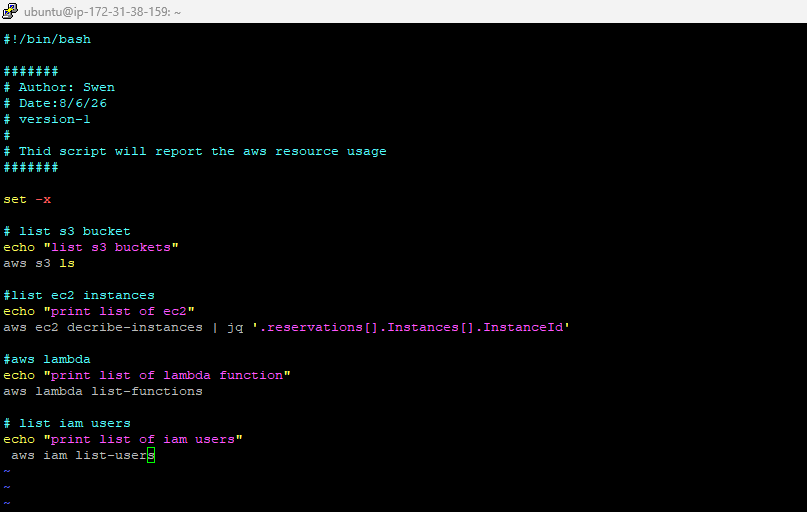
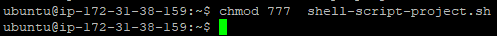
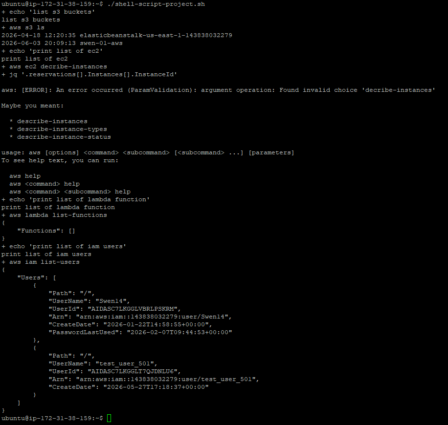
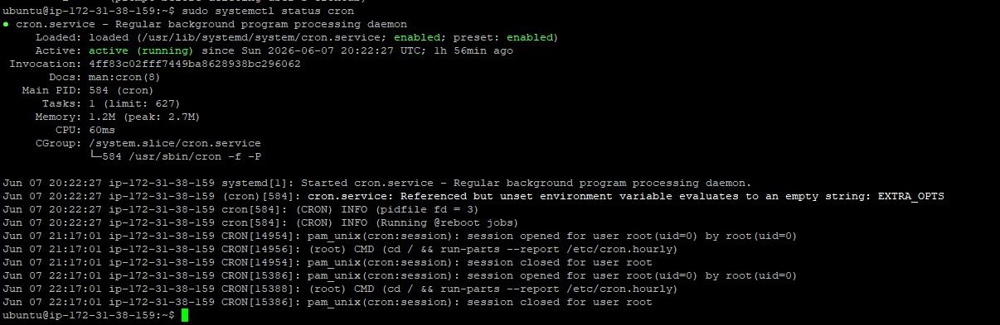

# AWS Resource Tracker Shell Script

## Project Overview

This project demonstrates how to automate AWS resource monitoring using a Bash shell script and AWS CLI.

The script retrieves information about commonly used AWS resources and displays them in the terminal. This helps reduce manual effort and provides a simple introduction to infrastructure automation using shell scripting.

## Objectives

* Learn Bash Shell Scripting
* Use AWS CLI to interact with AWS services
* Automate repetitive AWS monitoring tasks
* Practice Linux command-line operations
* Build a beginner-friendly DevOps project

---

## AWS Services Used

* Amazon S3
* Amazon EC2
* AWS Lambda
* AWS IAM

---

## Project Architecture

```text
Shell Script
      │
      ▼
   AWS CLI
      │
      ▼
AWS Account Resources
 ├── S3 Buckets
 ├── EC2 Instances
 ├── Lambda Functions
 └── IAM Users
```

---

## Script Used

```bash
#!/bin/bash

set -x

echo "Printing S3 Buckets"
aws s3 ls

echo "Printing EC2 Instances"
aws ec2 describe-instances

echo "Printing Lambda Functions"
aws lambda list-functions

echo "Printing IAM Users"
aws iam list-users

echo "Resource tracking completed successfully"
```

---

## Prerequisites

Before running the script, ensure the following are installed and configured:

* Linux (Ubuntu)
* AWS CLI
* AWS Account
* IAM User with AWS CLI permissions
* Configured AWS Credentials

Verify AWS CLI installation:

```bash
aws --version
```

Verify AWS credentials:

```bash
aws sts get-caller-identity
```

---

## How to Run the Project

### Step 1: Create the Script

```bash
vim aws-resource-tracker.sh
```

Paste the script and save the file.

---

### Step 2: Give Execute Permission

```bash
chmod +x aws-resource-tracker.sh
```

---

### Step 3: Execute the Script

```bash
./aws-resource-tracker.sh
```

---

## Sample Output

```text
Printing S3 Buckets
bucket-1
bucket-2

Printing EC2 Instances
InstanceId: i-xxxxxxxxxxxxx

Printing Lambda Functions
FunctionName: demo-function

Printing IAM Users
UserName: admin
```

---

## Cron Job Automation

Cron jobs can be used to schedule the script to run automatically at fixed intervals.

Open the cron editor:

```bash
crontab -e
```

Schedule the script to run every day at 6:00 PM:

```bash
0 18 * * * /home/ubuntu/aws-resource-tracker.sh
```

View existing cron jobs:

```bash
crontab -l
```

Check cron service status:

```bash
systemctl status cron
```

---

## Screenshots

### Screenshot 1 – Script Creation



---

### Screenshot 2 – Grant Execute Permission



---

### Screenshot 3 – Script Execution



---

### Screenshot 4 – Cron Service Status



---

## Commands Used

See:

```text
commands/commands-used.md
```

---

## Skills Demonstrated

* Linux Fundamentals
* Bash Shell Scripting
* AWS CLI
* AWS Resource Monitoring
* Task Automation
* Infrastructure Visibility
* DevOps Fundamentals
* GitHub Documentation

---

## Learning Outcomes

Through this project, I learned:

* How shell scripts automate repetitive tasks
* How to interact with AWS services using AWS CLI
* How to manage file permissions in Linux
* How to execute Bash scripts
* How to schedule automated tasks using Cron Jobs
* How to document a project professionally using GitHub

---

## Future Improvements

* Store output in log files
* Export results to CSV format
* Add error handling
* Send email notifications
* Monitor additional AWS services
* Generate automated reports

---

## Disclaimer

This project was created for learning and educational purposes. Commands, outputs, and AWS resources may vary depending on account configuration, AWS CLI version, permissions, and Linux distribution.

---

## Author

Swen Lemos

DevOps and Cloud Computing Learner
